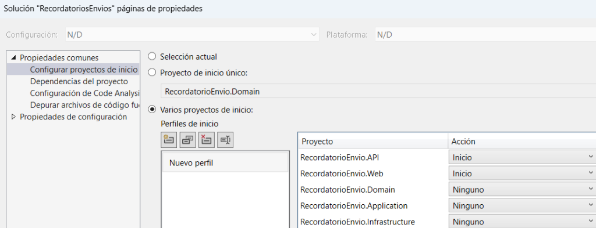

# 📧 Sistema de Recordatorio de Envío - TÜV SÜD

Bienvenido al repositorio del sistema **Recordatorio de Envío**. Esta solución ha sido diseñada para modernizar la gestión de respuestas de clientes, manteniendo una compatibilidad total con el entorno tecnológico **Visual Studio 2017** y bases de datos **Oracle**.

---

## 🛠 Entorno de Desarrollo y Requisitos

Para garantizar el correcto funcionamiento y la capacidad de depuración, asegúrese de cumplir con los siguientes requisitos:

*   **IDE**: Visual Studio 2017 (o superior).
*   **Framework**: .NET Framework 4.7.2.
*   **Base de Datos**: Oracle 11g/12c/19c/21c (configurado en Web.config).
*   **Arquitectura**: Desacoplada (Frontend Web + Backend API + Notificaciones Email).

---

## 🚀 Guía de Inicio Rápido (VS 2017)

### 1. Apertura de la Solución
Abra el archivo `RecordatorioEnvioGesap.sln` con Visual Studio 2017.

### 2. Configuración Crítica: Inicio Múltiple
Este proyecto requiere que la **API** y la **Web** funcionen simultáneamente. **Si solo inicia uno, el sistema no funcionará.**

Configuración paso a paso:
1.  En el **Explorador de Soluciones**, haga clic derecho sobre la raíz: `Solución 'RecordatorioEnvioGesap'`.
2.  Seleccione **Propiedades**.
3.  Vaya a **Propiedades comunes** → **Proyecto de inicio**.
4.  Marque la opción **"Varios proyectos de inicio"**.
5.  Establezca la **Acción** en **"Inicio"** para los siguientes proyectos:
    *   `RecordatorioEnvio.API`
    *   `RecordatorioEnvio.Web`
6.  Pulse **Aceptar**.

### 3. Ejecución y Acceso
Pulse **F5**. Se abrirán dos instancias del sistema:

*   **Formulario de Cliente**: `https://localhost:[PUERTO]/index.html?id=[TOKEN_CIFRADO]`
    *   *Uso*: Es la interfaz que verá el cliente final cuando haga clic en el enlace del correo electrónico.
*   **Lanzadera de Control** *(solo disponible en desarrollo y pruebas)*: `https://localhost:[PUERTO]/debug_launcher.aspx`
    *   *Uso*: Consola para cifrar IDs, inspeccionar Oracle, auditar logs en tiempo real y diagnosticar la seguridad del sistema.

> [!TIP]
> **Acceso Rápido**: Si desea que Visual Studio abra automáticamente la Lanzadera al pulsar F5, haga clic derecho sobre `debug_launcher.aspx` en el Explorador de Soluciones y seleccione **"Establecer como página de inicio"**.

> [!NOTE]
> **Entornos desplegados:**
> - **Pruebas**: `https://gestion3-desa.atisae.com/WEB_REC_ENV_GESAP/` (servidor `SESMADE55003`, sitio IIS `Gestion3`).
> - **Producción**: Web en `https://portal-contrataciones.tuv-sud.es/WEB_REC_ENV_GESAP/` — API en `https://ws-dmz.atisae.com/API_REC_ENV_GESAP/` (servidores separados).

---

## 🤖 Integración con Inteligencia Artificial (Onboarding)

Este repositorio está **optimizado y configurado** para ser utilizado de forma segura con asistentes de Inteligencia Artificial (Cursor, Windsurf, GitHub Copilot, Antigravity IDE, etc).

Si acabas de llegar al proyecto, esta es tu guía rápida:

1. **Fuente de Verdad:** Lee el archivo [`docs/context.md`](docs/context.md). Es el manual arquitectónico y contiene las reglas estrictas de desarrollo del proyecto. Tu IDE con IA ya ha leído estas reglas de forma invisible a través de los archivos de configuración ocultos (`.cursorrules`, `.github/copilot-instructions.md`, etc) y las aplicará automáticamente para no romper el código.
2. **Biblioteca de Prompts (`/prompts`):** No reinventes la rueda. Hemos creado una carpeta llamada [`/prompts`](prompts/) que actúa como un repositorio de flujos de trabajo probados para la IA.
   - **Para ejecutar una tarea:** Simplemente abre tu chat de IA y dile: *"Lee el archivo `prompts/01_crear_nuevo_endpoint.md` y aplícalo paso a paso para la entidad X"*.
   - **Para guardar una tarea:** Cuando consigas que la IA resuelva un problema complejo y quieras guardarlo para el futuro o para tus compañeros, simplemente dile a tu asistente: *"Guarda las instrucciones que acabamos de usar en el archivo `/prompts/02_tu_tarea.md`"*.
3. **Mapeo de Base de Datos con IA:** El proyecto cuenta con un lector nativo de Oracle (`tools/OracleSchemaReader`). Si necesitas que la IA detecte nuevas tablas o columnas en BD para actualizarlas en el código C#, simplemente dile: *"Sincroniza el esquema de la tabla X"*. La IA ejecutará la herramienta de forma invisible. **Nota para desarrolladores:** Para que esto funcione, debes copiar el archivo `App.config.template` que hay en esa carpeta, renombrarlo a `App.config` e introducir tus credenciales de Oracle locales (el archivo `App.config` está ignorado en SVN por seguridad).
   - **¿Por qué una herramienta CLI propia y no un servidor MCP clásico?** Un servidor MCP estándar (Model Context Protocol) suele requerir instalar *Node.js*, mantener un servidor JSON-RPC corriendo en segundo plano y modificar archivos de configuración globales (`mcp.json`) en cada IDE de cada programador de la empresa. Para evitar esa fricción, hemos construido esta herramienta nativa en C# empaquetada como una "Skill". Esto permite que la IA consiga exactamente el mismo resultado de forma *Zero-Config*: cualquier compañero que se baje el SVN lo tiene listo para funcionar sin instalar nada externo al ecosistema .NET.

---

## 🧪 Testing y CI/CD Local

Para asegurar la calidad del código sin sobrecargar el flujo de trabajo en Visual Studio, disponemos de herramientas de validación rápida:

*   **`build_and_test.bat`**: Ejecuta este script desde la raíz del proyecto antes de hacer un *commit* al SVN. Se encargará de:
    1. Restaurar paquetes NuGet y limpiar la solución.
    2. Compilar en modo Release.
    3. Ejecutar las pruebas unitarias (Moq) para validar la lógica pura.
    4. Ejecutar las **pruebas de integración (Oracle)** validando base de datos sin dejar rastro (Rollback automático).
    > *Nota: Si ves errores `System.AppDomainUnloadedException` en tu entorno sobre `Oracle.ManagedDataAccess`, ignóralos. El propio `.bat` gestiona y enmascara de forma segura este ruido del driver.*

---

## 🔒 Reglas de Seguridad Críticas
* **Fuga de Información (CWE-200)**: Nunca devuelvas un objeto de excepción puro en los endpoints de la API (ej. `return InternalServerError(ex)`). Usa el método `SafeInternalServerError()` del controlador base. Esto garantiza que el Frontend solo reciba un mensaje amigable mientras el verdadero *Stack Trace* y mensaje SQL de Oracle queda registrado de forma segura por el `LogHelper`.

---

## 📂 Estructura del Proyecto

El sistema sigue una arquitectura de **Cebolla (Onion Architecture)** simplificada:

*   `src/RecordatorioEnvio.Domain`: Entidades de negocio e interfaces.
*   `src/RecordatorioEnvio.Application`: Lógica de servicios y DTOs.
*   `src/RecordatorioEnvio.Infrastructure`: Implementaciones de Oracle, Cifrado y Logs.
*   `src/RecordatorioEnvio.API`: Endpoints REST (ASP.NET Web API 2).
*   `src/RecordatorioEnvio.Web`: Interfaz de usuario y Proxy de comunicación.

---

## 📘 Documentación

Para una transición fluida, sigue la Guía de Lectura que te indicará en qué orden leer los manuales según tu perfil (desarrollador, operaciones, seguridad).

### Documentos en la carpeta `docs/`

| Documento | Descripción |
|---|---|
| [Guía de Lectura](docs/PASOS_GUIA_DOCUMENTACION.md) | Mapa de ruta: qué leer primero según tu rol. |
| **[🚀 Guía de Despliegue](docs/Plan_despliegue_Web_Api.md)** | **Documento único: requisitos, despliegue en pruebas con datos reales (`gestion3-desa.atisae.com`), IIS, cifrado y hardening de producción.** |
| [Guía de Cifrado de Configuración](docs/GUIA_CIFRADO_CONFIG.md) | Comandos `aspnet_regiis` para cifrar/descifrar cadenas de conexión en el servidor. |
| [Arquitectura Técnica](docs/ARQUITECTURA_TECNICA.md) | Diagramas de flujo y arquitectura detallada. |
| [Manual Técnico](docs/MANUAL_TECNICO.md) | Configuración técnica profunda, seguridad y logs. |
| [Manual Funcional](docs/MANUAL_FUNCIONAL.md) | Guía de uso de la aplicación para usuarios finales. |
| [Guía Demo Seguridad](docs/GUIA_DEMO_SEGURIDAD.md) | Protocolo de pruebas del sistema de bloqueo de IPs. |
| [Documentación Unificada](docs/Documentacion_Unificada_API_RECORDATORIO.md) | Versión completa consolidada, lista para imprimir. |

---

© 2026 TÜV SÜD - Todos los derechos reservados.
