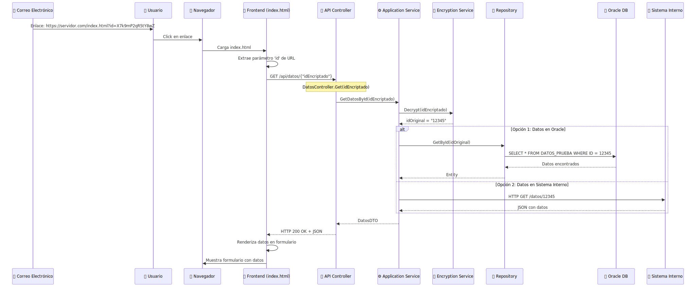
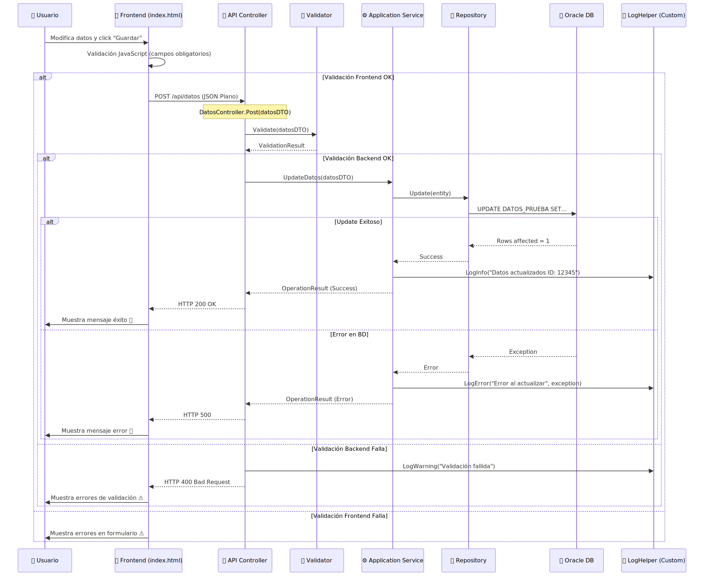

# Arquitectura Técnica - RecordatorioEnvio

## 1. Estructura de Proyectos y Dependencias

``

Ver código fuente del diagrama

`	ext
graph TB
    subgraph "Presentación"
        WEB["RecordatorioEnvio.Web HTML + jQuery + JS"]
        API["RecordatorioEnvio.API Web API Controllers + Swagger"]
    end
    
    subgraph "Lógica de Aplicación"
        APP["RecordatorioEnvio.Application Services + DTOs + Interfaces"]
    end
    
    subgraph "Dominio"
        DOM["RecordatorioEnvio.Domain Entities + Business Logic"]
    end
    
    subgraph "Infraestructura"
        INF["RecordatorioEnvio.Infrastructure Repositories + ADO.NET + Encryption + Logging"]
    end
    
    subgraph "Datos Externos"
        ORACLE[("Oracle Database DATOS_PRUEBA")]
        SYSINT["Sistema Interno Backend"]
    end
    
    subgraph "Testing"
        TEST["RecordatorioEnvio.Tests Unit Tests"]
    end
    
    WEB -->|AJAX GET/POST| API
    API --> APP
    APP --> DOM
    APP --> INF
    INF --> ORACLE
    INF --> SYSINT
    TEST -.->|Prueba| API
    TEST -.->|Prueba| APP
    TEST -.->|Prueba| INF
    
    style WEB fill:#e1f5ff
    style API fill:#fff4e1
    style APP fill:#f0e1ff
    style DOM fill:#ffe1e1
    style INF fill:#e1ffe1
    style ORACLE fill:#ffd700
    style SYSINT fill:#ffa500
    style TEST fill:#d3d3d3
`

``

## 2. Dependencias entre Proyectos

``

Ver código fuente del diagrama

`	ext
graph LR
    API["API"] --> APP["Application"]
    API --> INF["Infrastructure"]
    APP --> DOM["Domain"]
    APP --> INF
    INF --> DOM
    TEST["Tests"] --> API
    TEST --> APP
    TEST --> INF
    WEB["Web"] -.->|HTTP| API
    
    style API fill:#fff4e1
    style APP fill:#f0e1ff
    style DOM fill:#ffe1e1
    style INF fill:#e1ffe1
    style WEB fill:#e1f5ff
    style TEST fill:#d3d3d3
`

``

**Reglas de Dependencia:**
- ✅ **API** puede referenciar → Application, Infrastructure
- ✅ **Application** puede referenciar → Domain, Infrastructure
- ✅ **Infrastructure** puede referenciar → Domain
- ❌ **Domain** NO debe referenciar a nadie (núcleo puro)
- ✅ **Tests** puede referenciar → Todos los proyectos
- ✅ **Web** NO referencia proyectos (solo consume API vía HTTP)

---

## 3. Flujo de Petición GET (Consulta Inicial)

``

Ver código fuente del diagrama

`	ext
sequenceDiagram
    participant Email as 📧 Correo Electrónico
    participant User as 👤 Usuario
    participant Browser as 🌐 Navegador
    participant Frontend as 📄 Frontend (index.html)
    participant API as 🔌 API Controller
    participant Service as ⚙️ Application Service
    participant Encrypt as 🔐 Encryption Service
    participant Repo as 📊 Repository
    participant DB as 🗄️ Oracle DB
    participant SysInt as 🖥️ Sistema Interno
    
    Email->>User: Enlace: https://servidor.com/index.html?id=X7k9mP2qR5tY8wZ
    User->>Browser: Click en enlace
    Browser->>Frontend: Carga index.html
    Frontend->>Frontend: Extrae parámetro 'id' de URL
    
    Frontend->>API: GET /api/datos/{"idEncriptado"}
    Note over API: DatosController.Get(idEncriptado)
    
    API->>Service: GetDatosById(idEncriptado)
    Service->>Encrypt: Decrypt(idEncriptado)
    Encrypt-->>Service: idOriginal = "12345"
    
    alt Opción 1: Datos en Oracle
        Service->>Repo: GetById(idOriginal)
        Repo->>DB: SELECT * FROM DATOS_PRUEBA WHERE ID = 12345
        DB-->>Repo: Datos encontrados
        Repo-->>Service: Entity
    else Opción 2: Datos en Sistema Interno
        Service->>SysInt: HTTP GET /datos/12345
        SysInt-->>Service: JSON con datos
    end
    
    Service-->>API: DatosDTO
    API-->>Frontend: HTTP 200 OK + JSON
    
    Frontend->>Frontend: Renderiza datos en formulario
    Frontend->>Browser: Muestra formulario con datos
`

``

---

## 4. Flujo de Petición POST (Guardar Datos Modificados)

``

Ver código fuente del diagrama

`	ext
sequenceDiagram
    participant User as 👤 Usuario
    participant Frontend as 📄 Frontend (index.html)
    participant API as 🔌 API Controller
    participant Validator as ✅ Validator
    participant Service as ⚙️ Application Service
    participant Repo as 📊 Repository
    participant DB as 🗄️ Oracle DB
    participant Logger as 📝 LogHelper (Custom)
    
    User->>Frontend: Modifica datos y click "Guardar"
    Frontend->>Frontend: Validación JavaScript (campos obligatorios)
    
    alt Validación Frontend OK
        Frontend->>API: POST /api/datos (JSON Plano)
        Note over API: DatosController.Post(datosDTO)
        
        API->>Validator: Validate(datosDTO)
        Validator-->>API: ValidationResult
        
        alt Validación Backend OK
            API->>Service: UpdateDatos(datosDTO)
            Service->>Repo: Update(entity)
            Repo->>DB: UPDATE DATOS_PRUEBA SET...
            
            alt Update Exitoso
                DB-->>Repo: Rows affected = 1
                Repo-->>Service: Success
                Service->>Logger: LogInfo("Datos actualizados ID: 12345")
                Service-->>API: OperationResult (Success)
                API-->>Frontend: HTTP 200 OK
                Frontend->>User: Muestra mensaje éxito ✅
            else Error en BD
                DB-->>Repo: Exception
                Repo-->>Service: Error
                Service->>Logger: LogError("Error al actualizar", exception)
                Service-->>API: OperationResult (Error)
                API-->>Frontend: HTTP 500
                Frontend->>User: Muestra mensaje error ❌
            end
        else Validación Backend Falla
            API->>Logger: LogWarning("Validación fallida")
            API-->>Frontend: HTTP 400 Bad Request
            Frontend->>User: Muestra errores de validación ⚠️
        end
    else Validación Frontend Falla
        Frontend->>User: Muestra errores en formulario ⚠️
    end
`

``

---

## 5. Arquitectura de Capas (Clean Architecture Simplificada)

``

Ver código fuente del diagrama

`	ext
graph TB
    subgraph "Capa de Presentación"
        direction LR
        WEB["Web Frontend HTML/JS/jQuery"]
        API["API REST Controllers"]
    end
    
    subgraph "Capa de Aplicación"
        direction LR
        SERV["Services"]
        DTO["DTOs"]
        IFACE["Interfaces"]
    end
    
    subgraph "Capa de Dominio"
        direction LR
        ENT["Entities"]
        LOGIC["Business Logic"]
    end
    
    subgraph "Capa de Infraestructura"
        direction LR
        REPO["Repositories"]
        DATA["Data Access ADO.NET"]
        ENC["Encryption"]
        LOG["Logging"]
    end
    
    WEB --> API
    API --> SERV
    SERV --> DTO
    SERV --> IFACE
    SERV --> ENT
    SERV --> REPO
    REPO --> DATA
    REPO --> ENT
    DATA --> LOG
    SERV --> ENC
    
    style WEB fill:#e1f5ff
    style API fill:#fff4e1
    style SERV fill:#f0e1ff
    style DTO fill:#f0e1ff
    style IFACE fill:#f0e1ff
    style ENT fill:#ffe1e1
    style LOGIC fill:#ffe1e1
    style REPO fill:#e1ffe1
    style DATA fill:#e1ffe1
    style ENC fill:#e1ffe1
    style LOG fill:#e1ffe1
`

``

---

## 6. Componentes Principales

### **Frontend (Web)**
- **index.html**: Formulario principal con datos
- **debug_launcher.aspx**: Consola de administración (solo en Debug)
- **app.js**: Lógica JavaScript (AJAX, validaciones, dirty checking, modal de confirmación)
- **styles.css**: Estilos responsive basados en la intranet corporativa

### **API REST**
- **RecordatorioController**: 
  - `GET /api/recordatorio/{idEncriptado}` → Obtener datos del recordatorio
  - `POST /api/recordatorio` → Guardar datos modificados
- **Swagger y utilidades**: La documentación Swagger y el método de cifrado `GetEncrypt` están controlados por `EsDesarrollo` en `Web.config` (activos en pruebas, desactivados en producción).

### **Application Layer**
- **RecordatorioService**: Orquestador de la lógica de negocio
- **RecordatorioMapper**: Centraliza el mapeo DTO ↔ Entity
- **RecordatorioValidator**: Centraliza validaciones (longitud, XSS, formatos)
- **EmailTemplateBuilder**: Genera el HTML del correo de confirmación de oferta (tablas inline CSS compatibles con Outlook)
- **RecordatorioEnvioRespDto**: Objeto de transferencia de datos principal
- **IRecordatorioService**: Interfaz del servicio

### **Domain Layer**
- **RecordatorioEnvioResp**: Entidad principal del dominio
- **IRecordatorioRepository**: Interfaz del repositorio
- **IEmailNotificationService**: Interfaz del servicio de notificaciones por email
- Validaciones de negocio

### **Infrastructure Layer**
- **RecordatorioRepository**: Acceso a datos Oracle (SQL centralizado en constantes)
- **OracleConnectionFactory**: Gestión de conexiones
- **EncryptionService**: AES-256 encryption/decryption
- **EmailNotificationService**: Envío SMTP con logo CID embebido y validación de direcciones
- **LogHelper (Custom)**: Logging a archivo y BD

---

## 7. Flujo de Encriptación/Desencriptación

``

Ver código fuente del diagrama

`	ext
graph LR
    subgraph "Generación de Enlace"
        ID1["ID Original: 12345"]
        ENC["Encryption Service AES-256"]
        HASH["ID Encriptado: X7k9mP2qR5tY8wZ"]
        URL["URL Completa: https://.../index.html?id=X7k9mP2qR5tY8wZ"]
    end
    
    subgraph "Procesamiento de Petición"
        URL2["URL Recibida"]
        EXTRACT["Extraer parámetro 'id'"]
        DEC["Decryption Service AES-256"]
        ID2["ID Original: 12345"]
        QUERY["Query a BD: WHERE ID = 12345"]
    end
    
    ID1 --> ENC
    ENC --> HASH
    HASH --> URL
    
    URL --> URL2
    URL2 --> EXTRACT
    EXTRACT --> DEC
    DEC --> ID2
    ID2 --> QUERY
    
    style ENC fill:#ffd700
    style DEC fill:#ffd700
`

``

**Configuración de Encriptación:**
- Algoritmo: **AES-256**
- Clave: Almacenada en `Web.config` (encriptada)
- IV (Initialization Vector): Generado aleatoriamente
- Encoding: **Base64URL** (seguro para URLs)

---

## 8. Manejo de Errores y Logging

``

Ver código fuente del diagrama

`	ext
graph TD
    START["Petición HTTP"]
    TRY{"Try-Catch"}
    VALID{"Validación"}
    BIZ{"Lógica Negocio"}
    DB{"Acceso BD"}
    
    START --> TRY
    TRY --> VALID
    
    VALID -->|OK| BIZ
    VALID -->|Error| LOG_WARN["Log WARN (####) HTTP 400"]
    
    BIZ -->|OK| DB
    BIZ -->|Error| LOG_ERROR["Log ERROR (####) HTTP 500"]
    
    DB -->|OK| LOG_INFO["Log INFO HTTP 200"]
    DB -->|Error| LOG_ERROR
    
    LOG_WARN --> RESPONSE_ERROR["Response Error"]
    LOG_ERROR --> RESPONSE_ERROR
    LOG_INFO --> RESPONSE_OK["Response OK"]
    
    style LOG_INFO fill:#90EE90
    style LOG_WARN fill:#FFD700
    style LOG_ERROR fill:#FF6B6B
`

``

**Niveles de Log y destinos (v1.9.0):**

| Nivel | TXT (.txt) | BD Oracle | Separadores `####` en TXT |
|---|---|---|---|
| DEBUG | Si `Audit_LogLevel=DEBUG` | No (salvo config) | No |
| INFO | Si `Audit_LogLevel` ≤ INFO | Si `Audit_DbLogLevel` ≤ INFO | No |
| WARN | Si `Audit_LogLevel` ≤ WARN | Si `Audit_DbLogLevel` ≤ WARN | **Sí** |
| ERROR | Si `Audit_LogLevel` ≤ ERROR | Si `Audit_DbLogLevel` ≤ ERROR | **Sí** |
| FATAL | Si `Audit_LogLevel` ≤ FATAL | Si `Audit_DbLogLevel` ≤ FATAL | **Sí** |

**Campos enriquecidos en TXT (v1.9.0):**  
Cada entrada incluye: `[CorrID]`, `[IP]`, `[Method]`, `[User]`, `[URL]`, `[Agent]` y opcionalmente `[RID]`.  
Las entradas de tipo WARN/ERROR/FATAL añaden: `MENSAJE`, `EXCEPTION`, `INNER EX`, `SQL` y `STACKTRACE` en bloque delimitado.

---

## 9. Configuración de Seguridad

``

Ver código fuente del diagrama

`	ext
graph TB
    subgraph "Capas de Seguridad"
    ENC["Encriptación de ID AES-256 (ConstantTime)"]
    BLACK["BlackList (Confianza Red Interna)"]
    VALID["Validación de Datos Data Annotations (Anti-IDOR)"]
    SQL["Prevención SQL Injection Parámetros ADO.NET"]
    HEADERS["Strict Security Headers (CSP, HSTS, No-CORS)"]
    HTTPS["HTTPS Only Producción"]
end

REQUEST["HTTP Request"] --> ENC
ENC --> BLACK
BLACK --> VALID
VALID --> SQL
SQL --> HEADERS
HEADERS --> HTTPS
    
    style ENC fill:#FFD700
    style VALID fill:#90EE90
    style SQL fill:#FF6B6B
    style HEADERS fill:#87CEEB
    style HTTPS fill:#DDA0DD
`

``

---

## 10. Tecnologías y Librerías

| Componente | Tecnología | Versión |
|------------|-----------|---------|
| Framework | .NET Framework | 4.7.2 |
| API | ASP.NET Web API | 5.2.7 |
| ORM | ADO.NET | Nativo |
| Base de Datos | Oracle | 12c+ |
| Cliente Oracle | Oracle.ManagedDataAccess | 19.x |
| Logging | LogHelper (Custom) | Fichero + Oracle |
| Documentación API | Swashbuckle (Swagger) | 5.6.x |
| Testing | MSTest / NUnit | Última compatible |
| Frontend | jQuery | 3.6.x |
| Encriptación | System.Security.Cryptography | Nativo |
| Validación | Data Annotations | Nativo |

---

## 11. ⚙️ Configuraciones de AppSettings (Web.config)

A continuación se detallan las claves de configuración principales necesarias en el `Web.config`:

| Clave | Proyecto | Descripción | Pruebas | Producción |
| :--- | :--- | :--- | :--- | :--- |
| `EncryptionKey` | API + Web | Llave maestra para cifrado AES-256 (Base64) | Clave de pruebas | **Nueva clave** |
| `HmacKey` | API + Web | Llave para firma de integridad HMAC-SHA256 | Clave de pruebas | **Nueva clave** |
| `ApiKey` | API + Web | Token de comunicación interna Web ↔ API | Clave de pruebas | **Nueva clave** |
| `ApiBaseUrl` | Web | URL base de la API REST (usada por el Proxy) | `https://gestion3-desa.atisae.com/API_REC_ENV_GESAP/api` | `https://ws-dmz.atisae.com/API_REC_ENV_GESAP/api` |
| `EsDesarrollo` | API | Activa/desactiva la documentación Swagger y el método GetEncrypt | `true` | **`false`** |
| `LogRetentionDays` | API + Web | Días de retención de logs en disco | `30` | `30` |
| `RateLimit_Limit` | API | Umbral de peticiones permitidas por ventana | `500` | `500` |
| `RateLimit_WindowSeconds` | API | Duración (segundos) de la ventana de limitación | `60` | `60` |
| `Audit_LogLevel` | API + Web | Nivel mínimo para logs de archivo (`.txt`) | `WARN` | `WARN` |
| `Audit_DbLogLevel` | API | Nivel mínimo para logs en base de datos Oracle | `ERROR` | `ERROR` |
| `Log_EnableDb` | API | Interruptor maestro BD: `true`=escribe \| `false`=solo TXT | `true` | `true` |
| `Security_BlackList` | API + Web | IPs o rangos prohibidos (separados por coma) | `""` | `""` |
| `Security_BlackList_JsonPath` | API | Ruta al archivo JSON de bloqueos masivos | `~/App_Data/blacklist.json` | `~/App_Data/blacklist.json` |

> [!IMPORTANT]
> **Detalle del parámetro `EsDesarrollo`**: 
> Cuando este parámetro se establece en `true` en la API, habilita dos herramientas exclusivas para entornos de desarrollo y pruebas:
> 1. **Swagger UI**: Expone una interfaz gráfica interactiva (`/swagger`) que permite a los desarrolladores explorar, probar y entender rápidamente los endpoints de la API.
> 2. **Método `GetEncrypt`**: Habilita un endpoint de utilidad en la API que permite generar de forma rápida identificadores cifrados en Base64. Esto es estrictamente necesario para poder generar enlaces de prueba o para utilizar herramientas de diagnóstico como la Lanzadera de Control (`debug_launcher.aspx`), pero representa un riesgo de seguridad si se expone en producción. Por ello, **debe desactivarse** (`false`) en el entorno productivo.

> [!NOTE]
> A partir de la versión 1.8.0, la gestión de parámetros sensibles y de red de producción se automatiza utilizando transformaciones XML de despliegue (`Web.Release.config`), aislando las configuraciones locales de desarrollo.

---

## Resumen de Decisiones Arquitectónicas

> [!IMPORTANT]
> **Principios Clave:**
> 1. **Separación de Responsabilidades**: Cada capa tiene un propósito claro
> 2. **Simplicidad**: Arquitectura comprensible para equipos de desarrollo existentes
> 3. **Mantenibilidad**: Código limpio y bien organizado
> 4. **Seguridad**: Encriptación, validaciones, prevención de SQL injection
> 5. **Trazabilidad**: Logging completo de operaciones

> [!NOTE]
> **Adaptabilidad:**
> - DTOs, entidades y tablas son fácilmente reemplazables
> - Cadena de conexión configurable en Web.config
> - Sistema interno puede ser mockeado para pruebas
