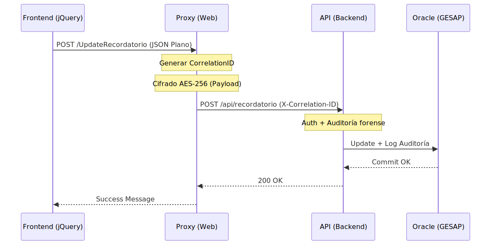

# 📘 Manual Técnico - Sistema de Gestión de Recordatorios de Envío

**Cliente:** TÜV SÜD  
**Versión:** 2.0.0 (Notificaciones Email + Estabilización)  
**Tecnología:** .NET Framework 4.7.2 + Web API 2 + Oracle + jQuery

---

## 🏗️ 1. Arquitectura del Sistema (Onion Architecture)

El proyecto sigue una **Arquitectura Cebolla (Onion Architecture)**, diseñada para desacoplar la lógica de negocio de las preocupaciones de infraestructura. Este enfoque garantiza que el núcleo de la aplicación sea independiente de la base de datos, APIs externas o interfaces de usuario.

### Diagrama de Dependencias (Capa a Capa)

``

<details>
<summary>Ver código fuente del diagrama</summary>

`	ext
graph BT
    subgraph Capa_Externa ["Capa Externa (Presentación / Entrada)"]
        direction BT
        Web["RecordatorioEnvio.Web (Proxy)"]
        API["RecordatorioEnvio.API (REST)"]
        
        subgraph Infraestructura ["Infraestructura / Servicios"]
            direction BT
            Infra["LogHelper, Encryption, OracleRepo"]
            
            subgraph Aplicacion ["Aplicación / Negocio"]
                direction BT
                App["RecordatorioService, DTOs"]
                
                subgraph Dominio ["Núcleo (Domain)"]
                    direction BT
                    Core["Entidades e Interfaces"]
                end
            end
        end
    end

    Web -.-> App
    API -.-> App
    App -.-> Core
    Infra -- Implementa --> Core
`
</details>``

### Componentes de la Solución
1.  **RecordatorioEnvio.Domain**: Contiene las entidades e interfaces de repositorio (El corazón del sistema).
2.  **RecordatorioEnvio.Application**: Contiene los DTOs, el `RecordatorioService` (orquestador), `RecordatorioMapper` (mapeo centralizado) y `RecordatorioValidator` (validación centralizada). Gestiona la lógica de negocio siguiendo el principio de Responsabilidad Única (SRP).
3.  **RecordatorioEnvio.Infrastructure**: Implementa el acceso a datos (Oracle), el cifrado y el registro de eventos (`LogHelper`).
4.  **RecordatorioEnvio.API**: Expone los servicios vía REST. Protegido por API Key.
5.  **RecordatorioEnvio.Web**: Aplicación MVC que sirve el frontend y actúa como Proxy seguro.

---

## 2. 🛡️ Seguridad

### 2.1 Cifrado de Datos
*   **Algoritmo**: AES-256 CBC + PKCS7.
*   **Validación**: HMAC-SHA256 para integridad de tokens.
*   **Payload Cifrado**: Todo el tráfico POST entre Web y API viaja cifrado dentro de una estructura `SecurePayload`.

### 2.2 Control de Acceso (BlackList Híbrida)
*   **Motor**: `SecurityService.cs`.
*   **Fuentes de Datos**: 
    1.  **Web.config**: Clave `Security_BlackList` para reglas rápidas y patrones con comodín (`10.45.*`).
    2.  **JSON Externo**: Archivo `~/App_Data/blacklist.json` para listados extensos de IPs exactas.
*   **Rendimiento**: La carga del JSON está optimizada con un sistema de **Caching en Memoria** que detecta automáticamente si el archivo ha cambiado sin necesidad de reiniciar la aplicación.
*   **Detección**: Bloqueo instantáneo con respuesta `403 Forbidden` y registro en el log de seguridad.

---

## 3. 🔄 Flujos de Datos

### Diagrama de Secuencia: Guardado Seguro

``

<details>
<summary>Ver código fuente del diagrama</summary>

`	ext
sequenceDiagram
    participant JS as Frontend (jQuery)
    participant PR as Proxy (Web)
    participant AP as API (Backend)
    participant BD as Oracle (GESAP)

    JS->>PR: POST /UpdateRecordatorio (JSON Plano)
    Note over PR: Generar CorrelationID
    Note over PR: Cifrado AES-256 (Payload)
    PR->>AP: POST /api/recordatorio (X-Correlation-ID)
    Note over AP: Auth + Auditoría forense
    AP->>BD: Update + Log Auditoría
    BD-->>AP: Commit OK
    AP-->>PR: 200 OK
    PR-->>JS: Success Message
`
</details>``

### 3.2 Gestión Automática de Estados
A partir de la versión **1.7.4**, el sistema automatiza la transición de estados para garantizar que cualquier interacción de guardado sea supervisada:
*   **Regla de Negocio**: Al ejecutar el método `SaveAll`, el repositorio fuerza el campo `ID_ESTADO_REC_ENVIO_RESPUESTA = 2` (PENDIENTE REVISIÓN).
*   **Impacto**: Se ignora cualquier valor de estado enviado desde el frontend, centralizando la lógica en la capa de datos para evitar manipulaciones accidentales.
*   **Refactorización v1.7.5**: Se ha migrado la tabla de notas de `RECORDATORIO_ENVIO_EQ_REV` a `RECORDATORIO_ENVIO_RESP_NOTA` (y la columna ID a `ID_RECORDATORIO_ENV_RESP_NOTA`) para mejorar la consistencia semántica, con mapeo automático de campos descriptivos. Además, se han eliminado los campos obsoletos (`DESCRIPCION_TIPO_EQUIPO`, `CONDICIONES_ECO_CORRECCION`, `IDENTIFICADOR_REC_ENVIO`) que ya no existen en la tabla principal.

---

## 3.3 Sistema de Notificaciones por Correo Electrónico (v2.0.0)

Tras el guardado exitoso de una oferta aceptada, la API envía automáticamente un correo de confirmación al titular. Este flujo se compone de tres elementos:

### Componentes

| Componente | Capa | Responsabilidad |
|---|---|---|
| `EmailTemplateBuilder.cs` | Application | Genera el HTML del correo con todos los datos de la oferta, usando tablas inline CSS compatibles con Outlook |
| `EmailNotificationService.cs` | Infrastructure | Envío SMTP con validación de direcciones, soporte multi-destinatario y logo CID embebido |
| `IEmailNotificationService.cs` | Domain | Contrato/interfaz del servicio de notificaciones |

### Características técnicas
*   **Logo embebido (CID)**: La imagen del octogono de TÜV SÜD se codifica en Base64 y se adjunta como `LinkedResource` con `ContentId = "logotuv"`. Esto evita que Outlook bloquee la imagen por políticas de seguridad.
*   **Validación de destinatarios**: Antes de enviar, se valida cada dirección de correo con `System.Net.Mail.MailAddress`. Las direcciones inválidas se ignoran y se registran como WARNING.
*   **Multi-destinatario**: Soporta múltiples correos separados por `;` o `,`. Si está configurado el campo `EmailEnvioGir` en `SYS_CONFIGURACION`, se añade automáticamente como destinatario adicional.
*   **Configuración SMTP**: Se obtiene dinámicamente de la tabla `GESAP.SYS_CONFIGURACION` de Oracle (servidor, puerto, usuario, contraseña, SSL). No requiere parámetros en `Web.config`.
*   **Tolerancia a fallos**: Si el envío del correo falla, los datos ya guardados en BD no se revierten. El sistema devuelve un mensaje de advertencia al usuario indicando que el guardado fue exitoso pero el correo no pudo enviarse.

---

## 4. 📝 Sistema de Auditoría y Logs

El sistema implementa una arquitectura de trazas dual con paridad de información entre ficheros TXT y base de datos Oracle:

### 4.1 Ficheros TXT (ambas capas)

*   **Rutas**: `~/App_Data/Logs/LogWeb_yyyyMMdd.txt` (Web) y `~/App_Data/Logs/LogApi_yyyyMMdd.txt` (API).
*   **Enriquecimiento (v1.9.0)**: Cada entrada incluye automáticamente `[CorrID]`, `[IP]`, `[Method]`, `[User]`, `[URL]` y `[Agent]`.
*   **Separadores visuales (v1.9.0)**: Los niveles `WARN`, `ERROR` y `FATAL` generan un bloque delimitado con `##########` para distinguirlos a simple vista en el fichero:

```
################################################## ERROR ##################################################
10:30:15 [API][ERROR] [CorrID: A1B2C3D4] [IP: 1.2.3.4] [Method: GET] [User: Anonymous] [URL: /api/recordatorio/xyz] [Agent: Mozilla/5.0...]
MENSAJE  : ERROR GET ID xyz: ORA-00942: table or view does not exist
EXCEPTION: ORA-00942: table or view does not exist
SQL      : SELECT * FROM GESAP.RECORDATORIO_ENVIO WHERE ID = :v_id
STACKTRACE:
   at RecordatorioEnvio.Infrastructure.Repositories.RecordatorioRepository.GetById(...)
##################################################
```

*   **Retención**: Configurable con `LogRetentionDays`. Limpieza automática al escribir cada entrada.

### 4.2 Auditoría en Base de Datos (Oracle)

*   **Tabla**: `GESAP.RECORDATORIO_ENVIO_LOGS`.
*   **Solo capa API** (la Web nunca escribe en BD directamente).
*   **Campos avanzados**: `LOG_DATE` (SYSDATE), `CORRELATION_ID`, `HTTP_METHOD`, `USER_AGENT`, `RECORD_ID`, `EXCEPTION_MSG` (CLOB), `STACKTRACE` (CLOB), `SQL_QUERY` (CLOB).
*   **Robustez**: Si la BD falla, el error se captura y se escribe en el TXT. La aplicación **nunca cae** por un fallo de logging.

### 4.3 Niveles de Log dinámicos

Jerarquía: `DEBUG < INFO < WARN < ERROR < FATAL < NONE`.

| Parámetro | Proyecto | Descripción | Valor recomendado |
|---|---|---|---|
| `Audit_LogLevel` | API + Web | Nivel mínimo para ficheros TXT | `WARN` |
| `Audit_DbLogLevel` | API | Nivel mínimo para BD Oracle | `ERROR` |
| `Log_EnableDb` | API | Interruptor maestro de BD (`true`/`false`) | `true` |

**Comportamiento de `Log_EnableDb` (v1.9.0):**

| `Log_EnableDb` | `Audit_DbLogLevel` | Resultado |
|---|---|---|
| `true` | `ERROR` | Solo ERROR + FATAL en BD (**producción**) |
| `true` | `WARN` | WARN + ERROR + FATAL en BD (debug) |
| `false` | cualquiera | **Nunca escribe en BD** (solo TXT) |
| *(no existe)* | cualquiera | Retrocompatible: funciona como `true` |

### 4.4 Trazabilidad cruzada

El `CorrelationID` (8 caracteres hexádecimal generado por el Proxy) se propaga vía cabecera `X-Correlation-ID` a la API. Permite rastrear una transacción completa buscando el mismo ID en el `LogWeb_*.txt`, `LogApi_*.txt` y la tabla `RECORDATORIO_ENVIO_LOGS`.


---

## 5. 🛠️ Lanzadera Pro: Consola de Auditoría

*   **Visor de Ficheros**: Lectura completa de archivos `.txt` locales.
*   **Visor de Auditoría (DB)**: Grid de alto rendimiento con los últimos 500 registros de auditoría de Oracle.
*   **Diagnóstico de Seguridad (Sección 5)**: Herramienta de "Doble Chequeo" que valida una IP contra las listas negras de la Web y la API simultáneamente.

---

## 6. ⚙️ Configuraciones de AppSettings (Web.config)

A continuación se detallan las claves de configuración principales necesarias en el `Web.config` para la API y el Proxy Web:

| Clave | Proyecto | Descripción | Pruebas | Producción |
| :--- | :--- | :--- | :--- | :--- |
| `EncryptionKey` | API + Web | Llave maestra para cifrado AES-256 (Base64) | Clave de pruebas | **Nueva clave** |
| `HmacKey` | API + Web | Llave para firma de integridad HMAC-SHA256 | Clave de pruebas | **Nueva clave** |
| `ApiKey` | API + Web | Token de seguridad corporativo Web ↔ API | Clave de pruebas | **Nueva clave** |
| `ApiBaseUrl` | Web | URL base de la API REST (Proxy y debuggers) | `https://gestion3-desa.atisae.com/API_REC_ENV_GESAP/api` | `https://ws-dmz.atisae.com/API_REC_ENV_GESAP/api` |
| `EsDesarrollo` | API | Activa/desactiva la documentación Swagger y el método GetEncrypt | `true` | **`false`** |
| `LogRetentionDays` | API + Web | Días de retención de logs en disco | `30` | `30` |
| `RateLimit_Limit` | API | Umbral de peticiones permitidas por ventana | `500` | `500` |
| `RateLimit_WindowSeconds` | API | Duración (segundos) de la ventana de limitación | `60` | `60` |
| `Audit_LogLevel` | API + Web | Nivel mínimo para logs de archivo `.txt` | `WARN` | `WARN` |
| `Audit_DbLogLevel` | API | Nivel mínimo para logs en base de datos Oracle | `ERROR` | `ERROR` |
| `Log_EnableDb` | API | Interruptor maestro BD: `true`=escribe \| `false`=solo TXT | `true` | `true` |
| `Security_BlackList` | API + Web | IPs o rangos prohibidos (ej: `1.2.3.4, 10.*`) | `""` | `""` |
| `Security_BlackList_JsonPath` | API | Ruta al archivo JSON de bloqueos masivos | `~/App_Data/blacklist.json` | `~/App_Data/blacklist.json` |

> [!IMPORTANT]
> **Detalle del parámetro `EsDesarrollo`**: 
> Cuando este parámetro se establece en `true` en la API, habilita dos herramientas exclusivas para entornos de desarrollo y pruebas:
> 1. **Swagger UI**: Expone una interfaz gráfica interactiva (`/swagger`) que permite a los desarrolladores explorar, probar y entender rápidamente los endpoints de la API.
> 2. **Método `GetEncrypt`**: Habilita un endpoint de utilidad en la API que permite generar de forma rápida identificadores cifrados en Base64. Esto es estrictamente necesario para poder generar enlaces de prueba o para utilizar herramientas de diagnóstico como la Lanzadera de Control (`debug_launcher.aspx`), pero representa un riesgo de seguridad si se expone en producción. Por ello, **debe desactivarse** (`false`) en el entorno productivo.

> [!NOTE]
> **Gestión de Entornos (Transformación XML):**
> A partir de la versión 1.8.0, se implementa el sistema de transformaciones XML (`Web.Release.config` / `Web.Debug.config`). Esto permite que los valores sensibles y las rutas de producción (como `ApiBaseUrl`, `ApiKey` y cadenas de conexión a base de datos Oracle) se inyecten de forma automática al compilar y publicar en modo **Release**, garantizando que el entorno local (`Web.config` por defecto) permanezca aislado y seguro para el desarrollo cotidiano.

> [!TIP]
> **Protección en Cascada (Sincronización de BlackList):**
> El sistema permite bloquear IPs en dos niveles para una seguridad total:
> 1.  **Nivel Web**: Bloquea el acceso al portal (interfaz de usuario). Se configura en el `Web.config` del proyecto Web.
> 2.  **Nivel API**: Bloquea el acceso profundo a los datos. Se configura en el `Web.config` de la API.
> 3.  **Transparencia (Multi-Capa)**: Gracias al uso de `X-Forwarded-For` y la reciente integración con cabeceras de **Imperva/Incapsula** (`Incap-Client-IP`), la API es capaz de reconocer la IP real del usuario aunque la petición pase por múltiples proxies o WAFs, permitiendo que las reglas de bloqueo se apliquen correctamente en ambos sitios.

---

## 7. 🧪 Pruebas y Buenas Prácticas de Seguridad

Para garantizar la estabilidad y seguridad del sistema, se ha implementado un entorno de pruebas mixto y políticas estrictas de control de errores.

### 7.1 Arquitectura de Pruebas Automáticas (`build_and_test.bat`)
El proyecto cuenta con más de 60 pruebas divididas en dos capas:
1.  **Pruebas Unitarias (MSTest + Moq)**: Aíslan la lógica de negocio simulando la base de datos y el servidor de correo (`IEmailNotificationService`). Garantizan que las reglas de negocio (ej. validaciones) funcionen sin dependencias externas.
2.  **Pruebas de Integración (MSTest + Oracle)**: Conectan directamente a la base de datos configurada para verificar el mapeo de columnas y el éxito de las sentencias SQL (ADO.NET). Utilizan `TransactionScope` o `OracleTransaction` seguido de un `Rollback` obligatorio para **no dejar basura en la tabla** tras probar los flujos completos.

> [!TIP]
> Si el script de pruebas en Oracle devuelve el error *`System.AppDomainUnloadedException`* en la consola, no afecta al resultado de la prueba. Es un comportamiento documentado del pool de conexiones `Oracle.ManagedDataAccess` al cerrarse de golpe el AppDomain de MSTest. El script `.bat` ya enmascara este ruido usando `2>nul`.

### 7.2 Prevención de Fuga de Información (Information Exposure - CWE-200)
Una de las normas críticas de arquitectura limpia en este proyecto es **ocultar la infraestructura al cliente**.
*   **Regla de Oro**: Ningún controlador debe devolver objetos de excepción (`Exception ex`) en sus retornos HTTP (ej. `return InternalServerError(ex)`).
*   **Motivo**: Serializar la excepción expone el *Stack Trace* completo, consultas SQL o rutas del servidor C# al cliente, lo que facilita ataques de reconocimiento.
*   **Implementación Activa**: Todos los controladores utilizan el método centralizado `SafeInternalServerError()`. Este método devuelve un JSON limpio y amigable (`{ message: "Ocurrió un error inesperado..." }`) para el Frontend, mientras que la excepción real es capturada y guardada silenciosa pero detalladamente por `LogHelper.Error(ex)` en Oracle y ficheros TXT.

---
© 2026 TÜV SÜD - Documentación Técnica Confidencial.
